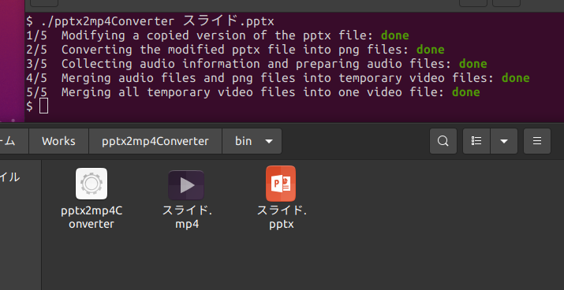
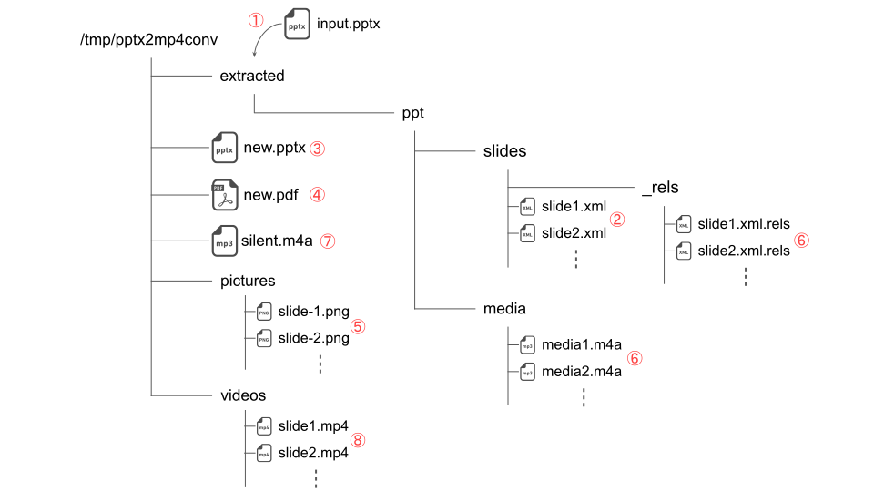

# pptx2mp4Converter


音声つきのPowerPointファイルを全自動で講義動画のような動画ファイルに変換します。

動作環境は**Linux Desktop環境**を想定しています。

<p align="left">
    
</p>

# 機能詳細

- 音声が付加されていないスライドが動画中で表示される時間の指定
- LibreofficeでPowerPointファイルをPDFに変換したときに表示されるアイコンの自動削除

# しくみ

<p align="left">
    
</p>

① 引数に渡したPowerPointファイルを展開

② `ppt/slides`以下の`slide*.xml`を解析し、オーディオアイコン（\#機能詳細 参照）に対応するタグを削除

③ ②の加工を施したファイル群を再びPowerPointファイルに圧縮

④ Libreofficeのコンバータを使ってPowerPointファイルをPDFファイルに変換

⑤ poppler-utilsを使って④のPDFファイルの各ページを連番pngファイルに変換

⑥ `ppt/slides/_rels`以下の`slide*.xml.rels`を解析し、そこに記述されている[Relationships](https://docs.microsoft.com/ja-jp/office/open-xml/structure-of-a-presentationml-document)に基づいて各スライドに対応するm4aファイルを取得

⑦ 音声の無いスライドを動画に変換する際に使う無音のm4aファイルを作成

⑧ ⑤のpngファイルと⑥, ⑦で取得したm4aファイルを合成し各スライドに対応するmp4ファイル群に変換

⑨ ⑧で生成したmp4ファイルらを同一コーデックで単純連結し、最終的なmp4ファイルを出力

# 依存パッケージ

- `libreoffice-core` : `libreoffice-impress`が依存
- `libreoffice-impress` : PowerPointファイル -> PDF変換に必要 (**注**)
- `default-jre` : `libreoffice-java-common`が依存
- `libreoffice-java-common` : Libreofficeの機能拡張に必要
- `poppler-utils` : PDF -> PNG画像変換に必要
- `ffmpeg` : 動画ファイルの生成に必要
- `libzip-dev` : PowerPointファイルの展開に必要
- `fonts-noto-cjk` : 日本語フォント
- `fonts-noto-cjk-extra` : 日本語フォント拡張パック

**注)** aptからインストールしたLibreofficeを使用するとPowerPointファイルをPDFに変換する処理に非常に長い時間がかかる問題が知られています。[Libreoffice公式ページ](https://ja.libreoffice.org/download/download/)からdebパッケージをダウンロードしてインストールすることをおすすめします。この場合、拡張機能は適宜インストールしてください。

依存パッケージは以下で一括インストールできます:
```bash
sudo apt update && sudo apt --no-install-recommends -y install libreoffice-core libreoffice-impress default-jre libreoffice-java-common poppler-utils ffmpeg libzip-dev fonts-noto-cjk fonts-noto-cjk-extra
```

# インストール

### linux-x86-64環境

[こちら](https://github.com/t0d4/pptx2mp4Converter/releases/latest)からビルド済みバイナリをダウンロードし、実行権限を付与してください。動作に必要な外部コマンド・共有ライブラリが揃っているかを`./pptx2mp4Converter --chkdeps`で確認できます。

Hint) 自分でビルドしたい方はNimの実行環境を整備し、`choosenim`, `nimble`をインストール後、レポジトリのルートで`nimble build -d:release`を実行してください。

### それ以外

サポートしていません。

# 使い方

`./pptx2mp4Converter --help`を実行すると表示されるヘルプメッセージを確認してください。
```
Usage:
  pptx2mp4conv <filename> [options]
  pptx2mp4conv --chkdeps
  pptx2mp4conv (-h | --help)
  pptx2mp4conv --version

Options:
  -o FILE --output=FILE             Name of the output mp4.
  -h --help                         Show this screen.
  --version                         Show the version.
  --chkdeps                         Check whether all dependencies are installed.
  --duration-of-silent-slide=<s>    Specify how long slides without audio will be shown in the output video. [default: 5]
  --libreoffice-executable=<path>   Path to the libreoffice executable. (See the Note below)
  --silent                          Do not show any messages.
```

Hint) Libreofficeをdebパッケージからインストールした場合、デフォルトではLibreofficeの実行ファイル`soffice`にパスが通っていません。この場合はPATH中に`soffice`の存在するディレクトリを追記するか、`--libreoffice-executable`オプションを用いて`soffice`の場所を明示的に指定することが出来ます。

# おや？Windowsをお使いですか？

Microsoft PowerPointを用いて[音声つきPowerPointファイルを動画ファイルに変換する](https://support.microsoft.com/ja-jp/office/%E3%83%97%E3%83%AC%E3%82%BC%E3%83%B3%E3%83%86%E3%83%BC%E3%82%B7%E3%83%A7%E3%83%B3%E3%82%92%E3%83%93%E3%83%87%E3%82%AA%E3%81%AB%E5%A4%89%E6%8F%9B%E3%81%99%E3%82%8B-c140551f-cb37-4818-b5d4-3e30815c3e83)ことができます。

<script src="https://blz-soft.github.io/md_style/release/v1.2/md_style.js" ></script>